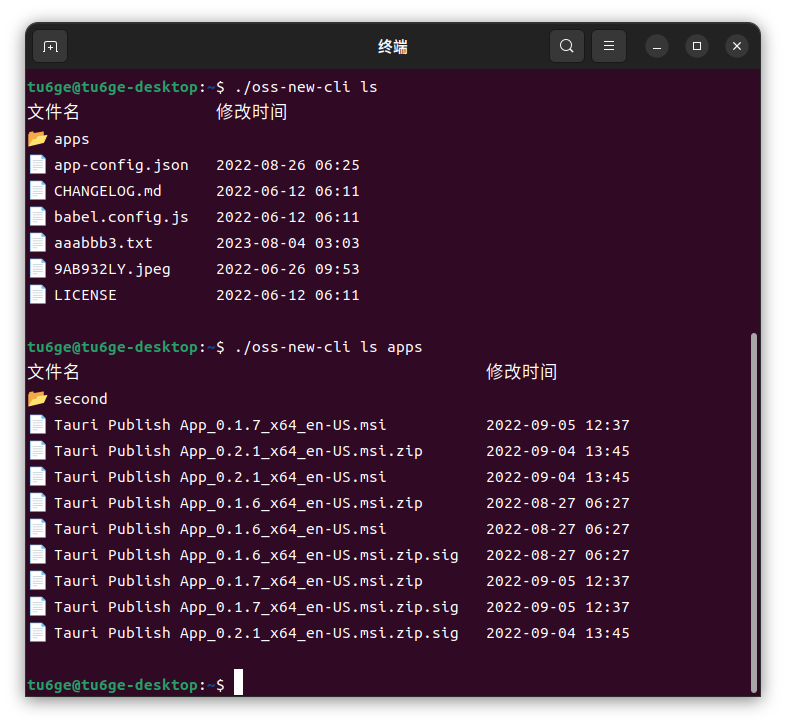

# aliyun-oss-client 的示例项目

支持使用命令行进行 OSS 文件的查找，上传，下载，删除等功能

## 用法
1. 先根据 .env-example 文件，设置好环境变量，

  下载 .env-example 文件，然后重命名为 .env ，修改里面的配置

2. 使用 git 安装 :

```
cargo install --git=https://github.com/tu6ge/oss-cli
```

2. 在刚才存放 `.env` 文件的目录运行 `oss-cli -h` 可得到如下提示：

```bash
Usage: oss-cli <COMMAND>

Commands:
  ls      读取文件列表
  up      上传文件
  down    下载文件
  delete  删除文件
  help    Print this message or the help of the given subcommand(s)
```

查看列表的效果展示

